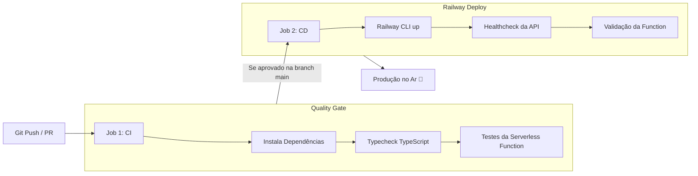

# 🚀 Guia da Pipeline de CI/CD: GitHub Actions -> Railway

Este documento explica como funciona a esteira de integração e entrega contínua (**CI/CD**) configurada para o projeto **VoleiPlay**.

---

## 🧭 1. Como a Pipeline Funciona

O arquivo de automação está localizado em [`.github/workflows/deploy-railway.yml`](./.github/workflows/deploy-railway.yml). Ele é dividido em duas etapas rigorosas:



1. **Job 1: `ci` (Integração Contínua)**:
   - Roda a cada `push` ou `pull_request`.
   - Executa `tsc --noEmit` no backend para garantir que não haja erros de tipos.
   - Executa os testes automatizados da função Serverless de cálculo de MVP (`verify-calculator.ts`).
   - Se qualquer teste falhar, o deploy **é cancelado imediatamente**, impedindo que código quebrado vá para produção.

2. **Job 2: `deploy` (Entrega Contínua)**:
   - Roda exclusivamente após o sucesso do Job 1 na branch `main`.
   - Utiliza a CLI oficial do Railway para enviar os arquivos ou acionar o build.
   - Faz um healthcheck automatizado no endpoint público `https://voleiplay-production.up.railway.app/health` e `/serverless/mvp-calculator` para atestar a saúde do sistema em produção.

---

## 🔑 2. Como Configurar o `RAILWAY_TOKEN` no GitHub (Passo a Passo)

Para que o GitHub Actions tenha permissão de interagir com o seu projeto no Railway:

### Passo 1: Gerar o Token no Railway
1. Acesse o painel do seu projeto no Railway:
   👉 [https://railway.com/project/ad1af909-505c-4e81-ab8c-33d473c0e888](https://railway.com/project/ad1af909-505c-4e81-ab8c-33d473c0e888)
2. Clique na aba **Settings** do projeto (no menu superior).
3. Role até a seção **Tokens** e clique em **"New Token"**.
4. Dê um nome (ex: `GITHUB_ACTIONS_TOKEN`) e selecione o ambiente `production`.
5. Copie o token gerado (começa com algo como `railway_tok_...`).

### Passo 2: Adicionar o Token no GitHub
1. Abra o repositório no GitHub:
   👉 `https://github.com/felipe-sbatista/voleiplay/settings/secrets/actions`
2. Clique no botão verde **"New repository secret"**.
3. Preencha:
   - **Name**: `RAILWAY_TOKEN`
   - **Secret**: cole o token copiado no passo 1.
4. Clique em **"Add secret"**.

---

## 🎯 3. Como Disparar o Deploy

Você tem duas formas de acionar a pipeline:

1. **Automática**: Basta fazer qualquer alteração e rodar:
   ```bash
   git push origin main
   ```
2. **Manual (1 clique)**:
   - Vá na aba **Actions** do seu GitHub.
   - Selecione a workflow **"VoleiPlay CI/CD - Railway Deployment"**.
   - Clique em **"Run workflow"** -> **"Run workflow"**.
