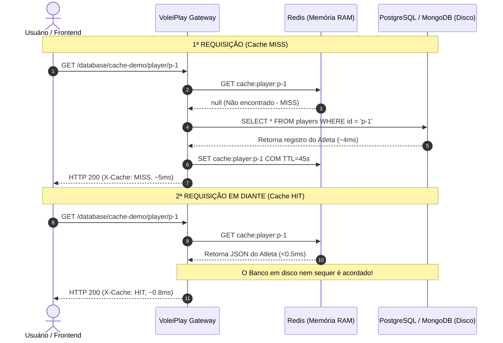

# 🏐 Guia Didático de Persistência Poliglota & Caching
## Laboratório Prático de Banco Relacional, NoSQL e In-Memory no VOLEIPLAY

Este guia foi elaborado para professores e alunos utilizarem durante a aula de **Arquitetura de Software e Engenharia de Dados**, explorando conceitos fundamentais de armazenamento moderno, Teorema CAP/PACELC, ACID vs BASE e estratégias de Caching de alta performance.

---

## 🧭 1. O que é Persistência Poliglota (Polyglot Persistence)?

Durante décadas, a arquitetura de software tradicional sofreu do antipadrão **"Golden Hammer" (Martelo de Ouro)**: a crença de que um único banco de dados relacional genérico deveria resolver todas as necessidades de um sistema:
- Dados transacionais de pagamento? SQL.
- Sessão de usuário? SQL.
- Logs e auditoria? SQL.
- Busca textual? SQL (`LIKE %termo%`).

Na década de 2010, cunhado por **Martin Fowler**, o termo **Persistência Poliglota** formalizou a prática adotada pelos gigantes de tecnologia: **escolher o motor de banco de dados cuja estrutura e garantias sejam as ideais para cada tipo de dado e carga de trabalho**.

### No VoleiPlay, cada motor tem um propósito cirúrgico:

| Motor | Tipo | Tecnologia | Papel no VoleiPlay | Garantia Principal |
| :--- | :--- | :--- | :--- | :--- |
| 🐘 **PostgreSQL 16** | Relacional Leve | SQL / Tabelas | Gestão contábil do torneio, premiações da Saga e atletas estruturados | **ACID Estrito** |
| 🍃 **MongoDB 7** | NoSQL Documental | BSON / JSON | Scouts de partidas, lances, mapa de calor na areia e dados aninhados | **Flexibilidade (BASE)** |
| ⚡ **Redis 7** | In-Memory Key-Value | Memória RAM | Caching de alta velocidade (Cache-Aside), sessões e invalidação rápida | **Latência Sub-Milissegundo** |
| 🔍 **Elasticsearch 7** | Search Engine | Inverted Index | Busca fonética de atletas e agregação de telemetria APM | **Full-Text Search & Analytics** |

---

## 🐘 2. PostgreSQL & Transações ACID

O **PostgreSQL** é o banco relacional de código aberto mais avançado do mundo. Ele opera no modelo **ACID**:

1. **Atomicidade (Atomicity)**: Todas as operações dentro de um bloco de transação (`BEGIN ... COMMIT`) são executadas com sucesso, ou NENHUMA alteração é persistida (`ROLLBACK`). Não existe estado "meio alterado".
2. **Consistência (Consistency)**: Toda alteração transita o banco de um estado válido para outro, respeitando `FOREIGN KEY`, `CHECK constraints` e tipos de dados estritos.
3. **Isolamento (Isolation)**: Duas transações concorrentes não enxergam dados sujos ou intermediários uma da outra antes do commit.
4. **Durabilidade (Durability)**: Uma vez que o banco responde `COMMIT`, o dado está gravado no disco físico via **WAL (Write-Ahead Logging)**, mesmo que haja corte repentino de energia.

### 🔬 Onde ver no projeto:
- Abra o Dashboard (`http://localhost:3000`) e clique em **"6. Transação ACID (COMMIT)"** para ver a carteira debitada com segurança.
- Clique em **"7. Falha na Transação (ROLLBACK)"** para simular uma falha e comprovar que o saldo original foi 100% restaurado sem corrupção contábil.
- Arquivo de código: `backend/shared/database/postgres.client.ts`.

---

## 🍃 3. MongoDB & O Modelo BASE

Bancos NoSQL orientados a documentos, como o **MongoDB**, abrem mão de junções relacionais rígidas (`JOINs`) e de schemas fixos em troca de **escalabilidade horizontal (Sharding)** e **flexibilidade na modelagem**:

Em vez de criar 5 tabelas relacionais com chaves estrangeiras:
`matches -> sets -> points -> players -> heatmap_coordinates`

O MongoDB armazena a partida como um **único documento JSON/BSON agregado e aninhado**:

```json
{
  "matchId": "match-final-2026",
  "tournament": "Circuito Brasileiro de Vôlei de Praia",
  "teams": {
    "teamA": { "player1": "Alison Mamute", "player2": "Bruno Schmidt", "score": 2 },
    "teamB": { "player1": "Evandro Gonçalves", "player2": "Arthur Lanci", "score": 1 }
  },
  "sets": [
    { "setNumber": 1, "scoreA": 21, "scoreB": 18 },
    { "setNumber": 2, "scoreA": 19, "scoreB": 21 }
  ],
  "advancedStats": {
    "aces": { "mamute": 5, "bruno": 2 },
    "sandHeatmapPoints": [
      { "x": 23, "y": 45, "type": "spike" },
      { "x": 67, "y": 88, "type": "block" }
    ]
  }
}
```

### O Modelo BASE:
- **Basically Available (Basicamente Disponível)**: O sistema prioriza responder requisições, mesmo em nós degradados.
- **Soft State (Estado Fluido)**: O estado dos dados pode convergir gradualmente sem necessidade de travas distribuídas.
- **Eventual Consistency (Consistência Eventual)**: Todas as réplicas eventualmente convergirão para o mesmo dado após a propagação da escrita.

---

## ⚡ 4. Redis & Caching de Alta Performance

O **Redis** mantém 100% dos dados na **memória RAM**, com gravação assíncrona em disco (RDB/AOF). Isso permite latências típicas de **0.1ms a 1ms**, cerca de 10 a 50 vezes mais rápido que consultas tradicionais ao disco.

### O Padrão Cache-Aside (Lazy Loading)

Este é o padrão de caching mais popular da indústria e está implementado no VoleiPlay:



### As 3 Armadilhas Clássicas de Caching para Discutir em Aula:

1. **Cache Stampede (Efeito Boiada / Thundering Herd)**:
   - *Cenário*: O atleta campeão olímpico tem milhões de acessos por segundo. O TTL da sua chave de cache expira.
   - *Problema*: Instantaneamente, 50.000 requisições simultâneas recebem `MISS` e disparam a mesma query pesada no PostgreSQL ao mesmo tempo, derrubando o banco relacional.
   - *Solução*: Mutex/Lock distribuído com Redis para que apenas 1 requisição vá ao banco enquanto as outras aguardam a renovação do cache.
2. **Cache Avalanche (Queda Simultânea)**:
   - *Cenário*: O desenvolvedor colocou `TTL = 3600` (exatamente 1 hora) para todos os 100.000 jogadores na hora do boot.
   - *Problema*: Após exatamente 60 minutos, todos os 100.000 itens expiram no mesmo segundo. O banco recebe uma avalanche de queries.
   - *Solução*: **Jitter aleatório** no TTL (ex: `TTL = 3600 + random(-300, 300)`).
3. **Cache Penetration (Penetração de Cache)**:
   - *Cenário*: Um invasor envia milhões de requisições buscando IDs inexistentes (`/players/id-fantasma-999999`).
   - *Problema*: Como o ID não existe, o Redis nunca grava o dado. Toda requisição atinge diretamente o banco de dados.
   - *Solução*: Gravar chaves vazias com TTL curto no Redis (`SET key null EX 30`) ou usar um **Filtro de Bloom**.

---

## ⚖️ 5. Teoremas CAP e PACELC

### Teorema CAP (Eric Brewer, 2000):
Em um sistema distribuído sujeito a **Partições de Rede (P)** (queda de cabos, latência entre datacenters), você só pode garantir uma das duas propriedades:
- **CP (Consistência + Tolerância a Partições)**: O sistema recusa leituras/escritas se não puder garantir que todos os nós têm o dado mais recente (ex: PostgreSQL em cluster síncrono, MongoDB com `w: "majority"`).
- **AP (Disponibilidade + Tolerância a Partições)**: O sistema aceita a requisição mesmo que corra o risco de retornar um dado temporariamente defasado (ex: DNS, Cassandra, DynamoDB).

### Teorema PACELC (Daniel Abadi, 2012):
Brewer esqueceu de responder: *E quando NÃO há partição de rede acontecendo?*
- Se há Partição (**P**), escolha entre Disponibilidade (**A**) e Consistência (**C**);
- **E**lse (em operação normal), escolha entre Latência (**L**) e Consistência (**C**).

*Exemplo*: O **Redis** e o **MongoDB** priorizam baixa Latência (**L**), enquanto o **PostgreSQL** com transações serializáveis prioriza Consistência (**C**).

---

## 📊 6. Observabilidade & Rastreamento dos Bancos no Elastic APM

Todos os motores de banco de dados foram instrumentados para gerar telemetria detalhada no **Elastic APM** e visualização gráfica no **Kibana** (`http://localhost:5601/app/apm`):

### Como cada banco é rastreado:
1. 🐘 **PostgreSQL**:
   - Spans automáticos e manuais de consultas: `type: 'db'`, `subtype: 'postgresql'`, `action: 'query'`.
   - Rastreamento de transações ACID: Spans nomeados `PostgreSQL ACID Transaction` com labels dinâmicas `acid.result: COMMIT / ROLLBACK`, `walletId`, e `amountCents`.
2. 🍃 **MongoDB**:
   - Spans de operações em coleções: `type: 'db'`, `subtype: 'mongodb'`, `action: 'insert' | 'find'`.
   - Labels automáticas identificando a coleção (`match_scouts`), IDs inseridos e contagem de documentos retornados.
3. ⚡ **Redis**:
   - Spans de operações em memória: `type: 'cache'`, `subtype: 'redis'`, `action: 'get' | 'set' | 'del'`.
   - Labels enriquecidas: `cache.hit: true/false`, `cache.key`, `cache.ttlSeconds`.
4. 🧭 **Rotas de Laboratório (`/database/*`)**:
   - Todas as rotas injetam a etiqueta `labModule` (`'cache-aside'`, `'acid-transaction'`, `'nosql-scout'`, `'database-benchmark'`), permitindo que na aula você filtre facilmente no Kibana apenas as transações do módulo demonstrado!

---

## 🎓 7. Roteiro Sugerido para o Professor Apresentar na Aula

### Passo 1: Contextualizar o Problema (5 min)
- Abra o Dashboard no navegador: `http://localhost:3000`.
- Pergunte aos alunos: *"Se vocês fossem projetar o sistema do Circuito Mundial de Vôlei, vocês colocariam a contabilidade financeira, o scout de cada saque e o ranking de duplas no mesmo banco relacional?"*

### Passo 2: O Laboratório de Latência ao Vivo (5 min)
- Clique no botão **"⏱️ 2. Executar Benchmark Comparativo (RAM vs Disco)"**.
- Observe a saída na tela:
  - O **Redis** responde em menos de 1 milissegundo.
  - O **PostgreSQL** e **MongoDB** levam alguns milissegundos a mais devido à garantia de gravação durável em disco (fsync / WAL).
  - Explique a pirâmide de memória de von Neumann: Registradores -> Cache L1/L2/L3 -> RAM -> NVMe SSD -> Rede.

### Passo 3: O Padrão Cache-Aside em Tempo Real (5 min)
- Clique em **"⚡ 3. Simular Leitura com Cache-Aside (HIT vs MISS)"**.
- Mostre aos alunos o status `MISS` (dado lido do banco e armazenado no Redis com TTL).
- Clique no botão novamente: O status muda imediatamente para `HIT ⚡`, com tempo de resposta quase instantâneo e sem tocar no banco relacional!
- Clique em **"🗑️ 4. Invalidar Cache do Jogador"** e volte a ler para mostrar o ciclo de vida da invalidação.

### Passo 4: Transações ACID vs Compensação de Saga (10 min)
- Clique em **"🐘 6. Transação ACID (COMMIT)"** e em seguida em **"💥 7. Falha na Transação (ROLLBACK)"**.
- Conecte este conceito com o módulo anterior da **Saga Pattern**:
  - *"Quando estamos em um único banco relacional, o PostgreSQL faz o ROLLBACK atômico para nós."*
  - *"Mas e quando temos dois microsserviços com bancos separados (Prêmios e E-mail)? Não existe ROLLBACK global! É por isso que precisamos da Saga e de transações compensatórias!"*

---

## 🧪 Comandos Úteis do Docker Compose

Para iniciar todos os bancos em containers:

```bash
# Sobe PostgreSQL, MongoDB, Redis e a Elastic Stack em background
docker compose up -d

# Para verificar a saúde dos containers:
docker compose ps

# Para acompanhar logs do PostgreSQL:
docker compose logs -f postgres

# Para acompanhar logs do Redis:
docker compose logs -f redis

# Para acompanhar logs do MongoDB:
docker compose logs -f mongodb
```
