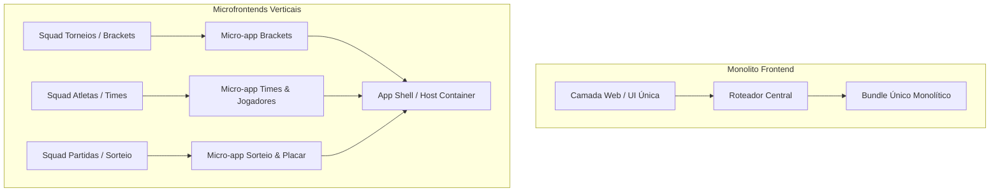

# 🌐 Aula 1: Frontend Moderno no Mercado

> **Visão Geral:** Do monólito tradicional aos microfrontends, padrões de renderização (SPA vs. SSR), gestão moderna de estado, ferramentas de build de alta performance, auditoria de métricas com Google Core Web Vitals e Progressive Web Apps (PWA).

---

## 1. Arquitetura Frontend: Monólitos vs. Microfrontends (MFE)

No desenvolvimento web em escala corporativa, a escolha arquitetural do frontend impacta diretamente a velocidade de entrega, a autonomia dos times e a experiência do usuário.



### 1.1 Monólito Frontend
* **Vantagens Técnicas:**
  * **Developer Experience (DX) simplificada:** Um único repositório, configuração compartilhada de TypeScript, lint e testes.
  * **Refatoração Segura:** Mudança de contratos de tipos ou componentes compartilhados reflete imediatamente em todo o projeto em tempo de compilação.
  * **Deploy Atômico:** Versão única da interface em produção, sem risco de incompatibilidade entre fragmentos.
* **Gargalos de Escala:**
  * Conflitos constantes de mesclagem (merge conflicts) com dezenas de desenvolvedores na mesma base de código.
  * Tempos de build e pipeline de CI/CD excessivamente longos.
  * Deploy acoplado: um bug crítico no módulo de sorteio pode atrasar o lançamento de melhorias no módulo de autenticação.
* **Cenário Ideal:** Startups, produtos em fase inicial/MVP, e sistemas corporativos com equipes de até 15-20 desenvolvedores (ex: a arquitetura atual de módulo único do Voleiplay em Angular).

### 1.2 Microfrontends (MFE)
* **Vantagens Técnicas:**
  * **Organização Vertical (Feature Teams):** Cada squad é dona do ciclo de vida completo de sua funcionalidade (desde o banco até a interface).
  * **Pipelines Independentes:** Cada MFE pode ser construído, testado e publicado sem reiniciar ou re-compilar os demais.
  * **Poliglota (quando estritamente necessário):** Possibilidade de coexistência entre frameworks (ex: Angular, React ou Vue), embora a padronização seja altamente recomendada para evitar sobrecarga de memória.
* **Custos Operacionais e Desafios:**
  * **Orquestração de Shell:** Gerenciamento de roteamento global, autenticação compartilhada e barramento de eventos entre micro-apps.
  * **Sobrecarga de Runtime:** Risco de download duplicado de bibliotecas e frameworks se o compartilhamento de dependências (*shared dependencies*) não estiver bem configurado.
  * **Governança de Design System:** Garantir que todos os microfrontends sigam rigorosamente a mesma biblioteca de componentes visuais e tokens de acessibilidade.
* **Tecnologias-Chave:**
  * **Webpack / Vite Module Federation:** Carregamento dinâmico de módulos remotos em tempo de execução via protocolo ESM.
  * **Web Components (Custom Elements & Shadow DOM):** Encapsulamento nativo de estilos e lógica sem vazamento de CSS.

---

## 2. Modelos de Renderização: SPA vs. SSR e Impacto em SEO

A forma como o navegador recebe e processa o código HTML define métricas críticas de negócio, como taxa de conversão e custo de infraestrutura.

| Critério de Decisão | SPA (Single Page Application) | SSR (Server-Side Rendering) | SSG / ISR (Static & Incremental) |
| :--- | :--- | :--- | :--- |
| **Ponto de Renderização** | Navegador do cliente via JavaScript | Servidor Web por requisição HTTP | Pré-renderizado em build / sob demanda |
| **HTML Inicial** | Praticamente vazio (`<div id="root"></div>`) | HTML completo com conteúdo semântico | HTML estático pré-gerado em CDN |
| **SEO e Web Crawlers** | Limitado; crawlers antigos/básicos não executam JS complexo | Excelente; conteúdo imediatamente disponível para indexação | Imbatível; velocidade pura de entrega estática |
| **Metatags Dinâmicas (OpenGraph)** | Requer servidores proxy ou prerender dinâmico | Nativo para cada URL gerada | Nativo para cada página gerada |
| **Custo de Infraestrutura** | Muito baixo (hospedagem em buckets/CDN estática: S3, Cloudflare Pages) | Requer servidores Node.js/Edge ativos com CPU e memória contínua | Baixo (arquivos estáticos em borda com revalidação) |
| **Caso de Uso Recomendado** | **SaaS internos, dashboards logados, painéis administrativos (como o Voleiplay)** | **E-commerces, portais de notícias, landing pages públicas com alto foco em busca orgânica** | **Blogs, documentações técnicas, páginas institucionais** |

---

## 3. Ecossistema: Bibliotecas Base vs. Meta-Frameworks

O desenvolvimento frontend ultrapassou o estágio onde apenas uma biblioteca declarativa de UI é suficiente para estruturar uma aplicação de produção:

1. **Bibliotecas Base (React, Vue, etc.):**
   * Focadas estritamente na árvore de componentes e reatividade declarativa.
   * Exigem tomada de decisão individual para: roteamento, bundler, server-side data fetching e code-splitting.
2. **Meta-Frameworks (Next.js, Nuxt, SvelteKit, Angular com SSR/Hydration):**
   * Padronização corporativa: Convenção de rotas baseada no sistema de arquivos (*filesystem routing*).
   * Suporte nativo a SSR, Server Actions, streaming de HTML e otimização automatizada de imagens e fontes.
3. **Gestão de Estado Moderna:**
   * **Estado de Servidor (Server State):** Ferramentas como **TanStack Query (React Query)** e **SWR** assumem cache, deduplicação de requisições, refetch em background e mutações otimistas, eliminando grande parte do código de boilerplates tradicionais.
   * **Estado de Cliente (Client State):** Substituição gradual de árvores globais gigantes (como Redux monolítico) por stores leves e atômicas baseadas em sinais ou seletores granulares (**Zustand, Jotai, Angular Signals**).

---

## 4. Bundlers Modernos e Técnicas de Otimização

A transição das ferramentas de bundling reduziu drasticamente o tempo de inicialização em desenvolvimento e otimizou o tamanho dos artefatos em produção:

* **Evolução das Build Tools:**
  * **Webpack:** Tradicional, baseado em empacotamento completo de módulos em memória antes de servir localmente.
  * **Vite / Turbopack:** Aproveitam **ES Modules (ESM)** nativos no navegador durante o desenvolvimento e utilizam compiladores ultrarrápidos em Go/Rust (`esbuild`, `SWC`, `Rollup`) para Hot Module Replacement (HMR) instantâneo.
* **Code Splitting Dinâmico:**
  * Quebra intencional do bundle principal em chunks sob demanda carregados apenas quando o usuário acessa rotas específicas via import dinâmico:
  ```typescript
  // Exemplo de Lazy Loading de rotas no Angular
  {
    path: 'brackets',
    loadComponent: () => import('./features/brackets/brackets.component').then(m => m.BracketsComponent)
  }
  ```
* **Tree Shaking Rigoroso:**
  * Algoritmo de análise estática do grafo de dependências ESM que remove código morto (*dead code*) e funções não utilizadas das bibliotecas finais de produção.

---

## 5. Diagnóstico de Performance no Browser (Chrome DevTools)

Otimização de software web deve ser baseada em medições reais e rastreamento de gargalos, e não em suposições.

### Ferramentas Críticas do Chrome DevTools:
1. **Aba Performance (Profiling):**
   * **Long Tasks:** Qualquer tarefa no navegador que ultrapasse **50ms** bloqueia a *Main Thread* do JavaScript, impedindo resposta imediata a cliques e inputs de usuários.
   * **Frame Rate (FPS):** Detecção de quedas bruscas de taxa de quadros (*jank*) causadas por recalculos forçados de layout (*layout thrashing*).
2. **Aba Network:**
   * Inspeção do gráfico de cascata (*waterfall*) de requisições.
   * Identificação de dependências bloqueantes de renderização (*render-blocking resources*).
3. **Coverage Tool (Cobertura de Código):**
   * Mede exatamente a porcentagem de bytes de CSS e JS transferidos que **não** foram executados no carregamento inicial da página.

---

## 6. Métricas Oficiais do Google: Core Web Vitals

Métricas centradas no usuário final que impactam a retenção, a taxa de conversão e o ranqueamento orgânico no Google:

| Métrica | Nome Completo | O que mede | Meta Ideal | Impacto Principal |
| :--- | :--- | :--- | :--- | :--- |
| **LCP** | *Largest Contentful Paint* | Velocidade de carregamento percebida | **$\le$ 2.5 segundos** | Tempo até a renderização do maior bloco de texto ou imagem visível. |
| **INP** | *Interaction to Next Paint* | Responsividade da interface | **$\le$ 200 milissegundos** | Latência entre a interação física do usuário (clique, toque) e a próxima atualização visual da tela. |
| **CLS** | *Cumulative Layout Shift* | Estabilidade visual | **$\le$ 0.1** | Deslocamento inesperado de elementos na tela enquanto assets e anúncios são baixados. |

---

## 7. PWA: Progressive Web Apps

Estratégia para transformar aplicações web em experiências similares às de aplicativos nativos sem passar por lojas de aplicativos convencionais:

* **Web App Manifest (`manifest.json`):**
  * Define metadados como nome do app, tema de cores, ícones de alta resolução e modo de exibição (`display: standalone`), permitindo a instalação na tela inicial do sistema operacional.
* **Service Workers:**
  * Threads executadas em segundo plano, desacopladas do DOM da página.
  * Interceptam todas as chamadas de rede da aplicação (atuando como um proxy reverso no cliente).
* **Estratégias Fundamentais de Cache:**
  * **Cache First:** Procura o recurso no cache local; se existir, entrega imediatamente. Ideal para fontes, imagens estáticas e scripts imutáveis.
  * **Network First:** Tenta a conexão remota; em caso de falha ou offline, recorre ao cache local. Ideal para dados transacionais ou cotações em tempo real.
  * **Stale While Revalidate:** Responde instantaneamente com a versão em cache e dispara uma chamada em segundo plano para atualizar o cache para a próxima visualização. Excelente compromisso entre latência e atualização de dados.
