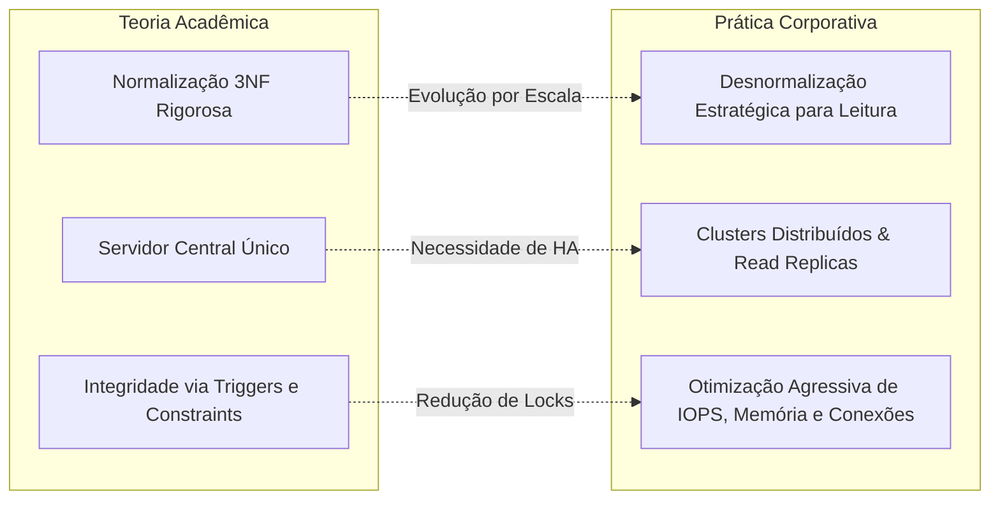
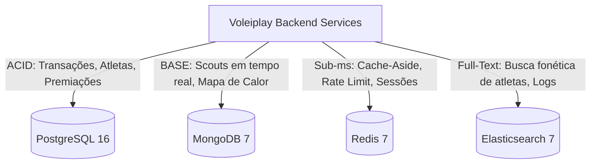
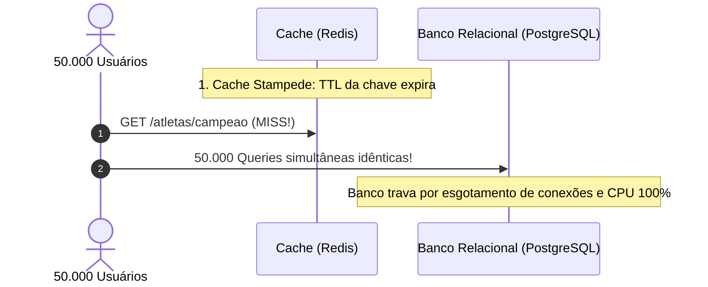
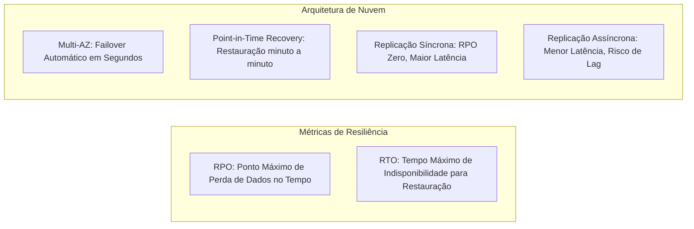

# 🗄️ Aula 2: Banco de Dados no Mercado Corporativo de TI

> **Visão Geral:** Do modelo teórico acadêmico à operação real em produção. Persistência poliglota, trade-offs entre ACID e BASE, armadilhas clássicas de caching em Redis, mitigação de N+1, pool de conexões com PgBouncer, diagnóstico com EXPLAIN ANALYZE e estratégias de Disaster Recovery.

---

## 1. O Modelo Teórico vs. A Realidade em Produção

Existe uma distância significativa entre o ensino tradicional de bancos de dados e a arquitetura de dados operada em ambientes de alta escala:



* **Normalização (3NF) vs. Desnormalização:** Na teoria, a 3ª Forma Normal elimina qualquer redundância. Em produção corporativa, joins excessivos (5 ou mais tabelas) geram planos de execução lentos e alto custo de CPU/IOPS. A desnormalização controlada é essencial para leituras com latência na casa dos milissegundos.
* **O Mito do Servidor Central Único:** Nenhuma aplicação moderna de missão crítica opera sobre um nó único sem réplicas de leitura, instâncias Multi-AZ e balanceamento de conexões.

---

## 2. O Antipadrão *Golden Hammer* e a Persistência Poliglota

Por anos imperou a prática de tentar forçar um banco relacional único a resolver todas as demandas de um produto digital:
* Dados contábeis? SQL.
* Sessão e tokens voláteis? SQL.
* Logs e auditoria em lote? SQL.
* Busca textual fonética? SQL (`LIKE %termo%` com *full table scan*).

A arquitetura corporativa moderna adota a **Persistência Poliglota**, delegando cada perfil de dado ao motor especializado mais adequado:

### 2.1 Comparativo ACID vs. BASE

| Característica | ACID (Relacional Tradicional) | BASE (Sistemas Distribuídos / NoSQL) |
| :--- | :--- | :--- |
| **Significado** | *Atomicity, Consistency, Isolation, Durability* | *Basically Available, Soft state, Eventual consistency* |
| **Garantia Central** | Consistência forte e imediata | Alta disponibilidade e particionamento tolerante |
| **Transações** | Transações ACID delimitadas (`BEGIN ... COMMIT`) | Operações atômicas no documento / consistência eventual |
| **Escalabilidade** | Primariamente vertical (CPU, RAM, discos NVMe) | Horizontal nativa (sharding automático entre nós) |
| **Exemplo Típico** | PostgreSQL, MySQL, Oracle | MongoDB, Cassandra, DynamoDB |

---

## 3. Arquitetura Poliglota Aplicada ao Voleiplay

No projeto **Voleiplay**, cada motor de banco de dados atua com um papel cirúrgico e garantias bem delineadas:



1. **PostgreSQL 16 (Relacional):**
   * *Papel:* Gestão de entidades estruturadas (clubes, quadras, categorias), controle financeiro de inscrições e coordenação de premiações na Saga.
   * *Garantia:* ACID estrito, concorrência controlada por MVCC (*Multi-Version Concurrency Control*) e índices B-Tree.
2. **MongoDB 7 (NoSQL Documental):**
   * *Papel:* Armazenamento dos eventos de partida (*scouts* de jogo: saques, bloqueios, ataques), lances detalhados e mapa de calor das jogadas em quadra.
   * *Garantia:* Estrutura BSON flexível e aninhada, eliminando joins complexos em relatórios analíticos de jogo.
3. **Redis 7 (In-Memory Key-Value):**
   * *Papel:* Caching de alta performance com padrão *Cache-Aside*, invalidação rápida, controle de taxa de requisições (*Rate Limiting*) e sessões com TTL.
   * *Garantia:* Respostas sub-milissegundo em memória RAM e *Single-Threaded Event Loop* livre de locks de linha.
4. **Elasticsearch 7 (Search Engine):**
   * *Papel:* Busca fonética e tolerante a erros ortográficos de atletas e torneios com ranking BM25, além de telemetria e agregação de logs APM.

---

## 4. Redis: Baixa Latência e as 3 Armadilhas Clássicas de Caching

Embora o Redis entregue vazão extrema, seu uso sem estratégia pode colapsar o sistema:

### 4.1 As 3 Armadilhas Clássicas



1. **Cache Stampede (Efeito Boiada / Thundering Herd):**
   * *Cenário:* Uma chave muito acessada (ex: perfil do jogador destaque da final) expira seu TTL.
   * *Problema:* Dezenas de milhares de requisições simultâneas sofrem Cache Miss no mesmo milissegundo e disparam consultas pesadas diretamente no PostgreSQL, derrubando o banco relacional.
   * *Solução:* Implementar **Mutex/Lock Distribuído** no Redis (ex: `SET lock_key token NX PX 5000`). Apenas uma thread/requisição obtém o lock para recalcular o cache no banco; as outras aguardam ou consomem dado levemente obsoleto (*grace period*).
2. **Cache Avalanche (Queda Simultânea):**
   * *Cenário:* A aplicação sobe no boot e cadastra 100.000 registros de atletas no Redis com TTL fixo de exatamente 1 hora (`TTL = 3600`).
   * *Problema:* Após exatamente 60 minutos, todos os 100.000 registros expiram simultaneamente, gerando uma onda incontrolável de queries no banco de dados.
   * *Solução:* Adicionar **Jitter Aleatório** ao TTL:
     $$\text{TTL}_{\text{efetivo}} = \text{TTL}_{\text{base}} + \text{random}(-\Delta, +\Delta)$$
3. **Cache Penetration (Penetração de Cache):**
   * *Cenário:* Um usuário mal-intencionado dispara milhares de requisições buscando IDs de atletas inexistentes (`/players/id-fantasma-999999`).
   * *Problema:* Como o ID não existe, o cache nunca é preenchido. Toda requisição atinge diretamente o banco de dados.
   * *Solução:* Salvar o resultado nulo no cache com um TTL curto (`SET player:999999 "null" EX 30`) ou utilizar **Filtros de Bloom** (*Bloom Filters*) na entrada.

---

## 5. Camada de Aplicação: A Armadilha do Problema N+1

O problema N+1 ocorre quando um ORM realiza uma consulta inicial para listar $N$ entidades e, em seguida, dispara uma consulta adicional para cada entidade para carregar dados relacionados:

```typescript
// ❌ CÓDIGO PROBLEMÁTICO: Gera 1 query inicial + 100 queries subsequentes (101 round-trips)
const users = await userRepository.find({ take: 100 });
const resultado = users.map(user => {
  return {
    nome: user.name,
    perfil: user.profile.roleName // O ORM executa 'SELECT * FROM profiles WHERE id = ...' ocultamente!
  };
});
```

### Por que o N+1 é invisível em desenvolvimento e catastrófico em produção?
1. **Diferença de Latência de Rede:**
   * Em `localhost`, a latência de ping é de $0.1\text{ ms}$. 101 queries rodam em cerca de $10\text{ ms}$. Ninguém percebe.
   * Na nuvem (ex: aplicação no Kubernetes e banco no AWS RDS), a latência de rede entre nós é de $\approx 3\text{ ms}$.
   $$\text{Acréscimo de latência} = 100 \times 3\text{ ms} = 300\text{ ms apenas de tráfego de rede!}$$
2. **Esgotamento do Connection Pool:**
   * Se 20 usuários requisitarem essa página no mesmo instante:
   $$20 \times 101 = 2.020 \text{ queries simultâneas}$$
   * O pool de conexões do banco se esgota imediatamente (*too many connections*), enfileirando requisições e gerando timeout em cascata na aplicação.
* **Solução:** Utilizar **Eager Loading** com `JOIN` explícito ou `DataLoader` (em GraphQL/APIs) para agregar os dados em uma única viagem de ida e volta ao banco (*single round-trip*).

---

## 6. Recursos Críticos e Esgotamento de Conexões em Nuvem

* **O Limite de Conexões:** Uma instância gerenciada de banco de dados (ex: AWS RDS db.t4g.small) costuma ter limites rígidos de conexões simultâneas (geralmente entre 100 e 200). Cada conexão no PostgreSQL aloca memória de processo dedicada no sistema operacional.
* **O Gargalo Serverless (AWS Lambda / Cloud Functions):** Como as funções serverless escalam de zero a centenas de instâncias efêmeras independentes, cada execução tenta abrir sua própria conexão TCP direta com o banco, derrubando o banco em segundos.
* **Mitigação Corporativa:**
  * Uso obrigatório de poolers de conexão de alta performance como o **PgBouncer** ou **AWS RDS Proxy**, permitindo reaproveitamento agressivo de conexões abertas em nível transacional.

---

## 7. Diagnóstico e Resolução de Problemas Reais em Produção

Cinco incidentes clássicos vivenciados na indústria e suas soluções de engenharia:

1. **Tabela Não Suportava Mais Dados (Volume Excessivo):**
   * *Causa:* Tabelas históricas de logs/eventos acumulando dezenas de milhões de linhas e degradando índices B-Tree.
   * *Solução:* Particionamento declarativo de tabelas por intervalo temporal (*Range Partitioning*) e rotinas assíncronas de expurgo/arquivamento frio para S3/Data Lake.
2. **Triggers Ocultas para Auditoria Travando Writes:**
   * *Causa:* Triggers síncronas gravando dados em tabelas de auditoria dentro da mesma transação do negócio.
   * *Solução:* Extração da auditoria para fora da transação principal via captura de dados de alteração (*Change Data Capture - CDC*) com ferramentas como Debezium ou publicação de eventos no Kafka.
3. **Valores Gigantescos no Cache Redis (Consumo em MB):**
   * *Causa:* Desenvolvedores salvando objetos de catálogo inteiros com dezenas de MB em uma única chave de string.
   * *Solução:* Como o Redis é *single-threaded*, serializar e transferir megabytes bloqueia o servidor inteiro. Reestruturação com Hashes granulares (`HSET/HGET`) e compressão de payloads.
4. **Migrations de DDL Travando o Banco:**
   * *Causa:* Comandos como `ALTER TABLE ADD COLUMN NOT NULL DEFAULT ...` ou criação de Foreign Keys em tabelas com milhões de linhas bloqueiam a tabela inteira com locks exclusivos (*AccessExclusiveLock*).
   * *Solução:* Migrações em etapas com *Zero-Downtime*: criação de índices com `CREATE INDEX CONCURRENTLY` e adição de constraints com validação diferida (`NOT VALID` seguido de `VALIDATE CONSTRAINT`).
5. **Diagnóstico com `EXPLAIN ANALYZE`:**
   * Sempre auditar consultas lentas para identificar **Sequential Scans** (varredura completa da tabela) e transformá-los em **Index Scans** utilizando índices compostos balanceados.

---

## 8. Continuidade de Negócio e Disaster Recovery (DR)

> **Regra de Ouro:** *Backup não testado não é backup; backup não é estratégia de Disaster Recovery.*



* **RPO (Recovery Point Objective):** Quantos minutos ou horas de dados a empresa tolera perder em caso de catástrofe física no datacenter.
* **RTO (Recovery Time Objective):** Quanto tempo a equipe tem para colocar o serviço novamente online para os clientes.
* **Point-in-Time Recovery (PITR):** Combinação de snapshots diários com armazenamento contínuo dos logs de transações (WAL - *Write-Ahead Logging*), permitindo voltar o banco exatamente ao segundo anterior a uma exclusão indevida ou falha lógica.
