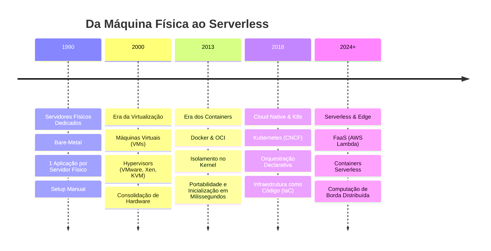
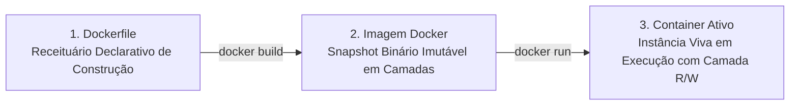
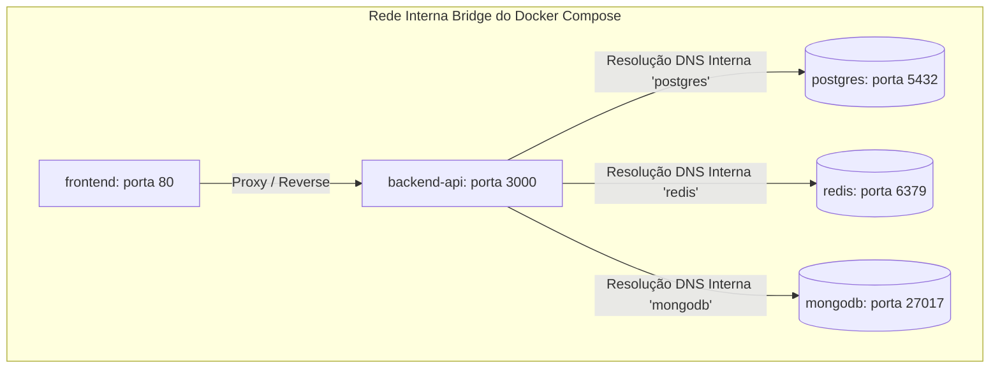

# 🐳 Aula 3: Containers e Virtualização no Mercado de TI

> **Visão Geral:** A evolução da infraestrutura moderna: da era dos servidores físicos bare-metal e máquinas virtuais até a orquestração de containers com Docker e Kubernetes (K8s). Fundamentos do kernel Linux, Dockerfile multi-stage, Docker Compose para desenvolvimento local e o ecossistema de produção Cloud Native.

---

## 1. Linha do Tempo: A Evolução da Infraestrutura de Servidores

A história da infraestrutura de software reflete uma busca contínua por **densidade, isolamento, velocidade de inicialização e eficiência de custos**:



* **1990 - Servidores Dedicados:** Uma máquina física inteira alocada para uma única aplicação. Provisionamento que levava semanas, altíssimo consumo elétrico e ociosidade de mais de 85% de CPU.
* **2000 - Virtualização (VMs):** O Hypervisor abstrai o hardware físico e permite criar múltiplas máquinas virtuais, cada uma com seu próprio Sistema Operacional completo (*Guest OS*).
* **2013 - Containers (Docker):** O isolamento migra do hardware para o nível de Sistema Operacional. As aplicações compartilham o mesmo kernel do Host, iniciando em milissegundos.
* **2018 - Cloud Native & K8s:** A escala de microsserviços exige orquestração automatizada para gerenciar ciclos de vida, resiliência, auto-recuperação e tráfego de rede.
* **Hoje - Serverless & Edge:** Abstração total da infraestrutura com execução sob demanda e tarifação por frações de milissegundo de uso.

---

## 2. Máquinas Virtuais (VMs) vs. Containers (Docker / OCI)

Compreender a diferença na pilha de isolamento é fundamental para qualquer engenheiro de software:

```mermaid
graph TD
    subgraph Arquitetura de Máquinas Virtuais
        VM_APP[Aplicações A / B / C]
        VM_BINS[Bibliotecas e Binários]
        VM_GUEST[Guest OS Completo por VM]
        VM_HYP[Hypervisor Tipo 1 ou 2]
        VM_HW[Hardware Físico / Servidor]
        VM_APP --> VM_BINS --> VM_GUEST --> VM_HYP --> VM_HW
    end

    subgraph Arquitetura de Containers
        C_APP[Aplicações A / B / C]
        C_BINS[Bibliotecas / Dependências]
        C_ENGINE[Container Engine / Containerd / Docker]
        C_OS[Sistema Operacional Host + Kernel Linux]
        C_HW[Hardware Físico / Servidor]
        C_APP --> C_BINS --> C_ENGINE --> C_OS --> C_HW
    end
```



### Matriz Comparativa Técnica

| Aspecto de Engenharia | Máquina Virtual (VM) | Container (Docker / OCI) |
| :--- | :--- | :--- |
| **Mecanismo de Isolamento** | Virtualização de Hardware via Hypervisor | Isolamento lógico via recursos nativos do Kernel Linux |
| **Sistema Operacional** | *Guest OS* completo com kernel dedicado por VM | Compartilha diretamente o mesmo Kernel do Host |
| **Mecanismos de SO Utilizados** | Emulação de instruções de CPU (VT-x, AMD-V) | **Namespaces** (isolamento de visão) e **cgroups** (limites de consumo) |
| **Tempo de Inicialização** | De minutos a dezenas de segundos (boot de SO) | De milissegundos a poucos segundos |
| **Tamanho em Disco** | Gigabytes (ex: 5 GB a 20 GB por imagem de VM) | Dezenas ou centenas de Megabytes (camadas imutáveis) |
| **Eficiência de Recursos** | Sobrecarga significativa de memória para o Guest OS | Overhead quase nulo; consome apenas o processo da aplicação |

### A VM Morreu? Não, Mudou de Papel!
As máquinas virtuais não desapareceram: elas deixaram de empacotar aplicações individuais e passaram a ser o **substrato de infraestrutura** sobre o qual os clusters de containers operam. Na nuvem (AWS EKS, GCP GKE, Azure AKS), cada nó do Kubernetes é, por baixo dos panos, uma instância de máquina virtual (como AWS EC2) que executa dezenas de containers com **10x a 50x mais densidade por hardware físico**.

---

## 3. O Dilema do Ambiente de Desenvolvimento

Antes da popularização dos containers, o ciclo de desenvolvimento sofria do clássico antipadrão **"Na minha máquina funciona!"**:

* **Incompatibilidade de Ambientes:** Um desenvolvedor rodava Node 16 no macOS, o colega utilizava Node 18 no Windows, e o servidor de homologação estava no Ubuntu com pacotes glibc divergentes.
* **Onboarding Lento e Doloroso:** Um novo membro na equipe levava dias para instalar e configurar PostgreSQL, Redis, RabbitMQ e dependências nativas diretamente no sistema operacional.
* **Poluição do Sistema Operacional:** Conflitos de variáveis de ambiente, portas de rede ocupadas e serviços locais deixados rodando em segundo plano.

### Docker no Cotidiano da Engenharia
Com o Docker, o ecossistema de desenvolvimento atinge previsibilidade absoluta:
1. **Dependências de Infraestrutura sob Demanda:** Bancos de dados, filas e serviços de cache sobem isolados com um comando, sem necessidade de instalação local no sistema operacional da máquina de trabalho.
2. **Isolamento de Runtimes:** É possível manter projetos com versões completamente diferentes de linguagens (ex: Node 16, 18 e 20) no mesmo computador sem conflitos no `PATH`.
3. **Onboarding em Minutos:** Clonar o repositório e executar `docker compose up` entrega o sistema completo pronto para execução.

---

## 4. A Tríade Fundamental do Docker

O ecossistema Docker se fundamenta em três conceitos complementares:



1. **Dockerfile (O Receituário):**
   * Arquivo de texto declarativo contendo instruções sequenciais (`FROM`, `WORKDIR`, `COPY`, `RUN`, `EXPOSE`, `CMD`).
2. **Imagem Docker (O Snapshot Imutável):**
   * Pacote binário imutável organizado em **camadas de leitura (read-only layers)** utilizando sistemas de arquivos como **OverlayFS / UnionFS**.
   * Quando múltiplos containers compartilham a mesma imagem base (ex: `node:20-alpine`), as camadas subjacentes são armazenadas uma única vez em disco.
3. **Container Ativo (A Instância em Execução):**
   * Processo vivo isolado no sistema operacional.
   * Recebe uma fina camada de leitura e escrita volátil (*Copy-on-Write layer*). Ao encerrar o container, tudo o que foi gravado nessa camada é descartado, garantindo total previsibilidade a cada inicialização.

---

## 5. Práticas Avançadas: Dockerfiles Eficientes com Multi-Stage Build

Em ambientes corporativos, criar imagens contendo compiladores, dependências de desenvolvimento e código fonte desnecessário é considerado uma falha crítica de segurança e desempenho:

### Exemplo de Multi-Stage Build (Padrão Frontend Angular / Voleiplay)

```dockerfile
# ----------------------------------------------------
# Estágio 1: Build da Aplicação (Ambiente de Compilação)
# ----------------------------------------------------
FROM node:20-alpine AS builder
WORKDIR /app

# Copia de manifests para cache eficiente de camadas
COPY package*.json ./
RUN npm ci

# Copia do código e compilação para produção
COPY . .
RUN npm run build -- --configuration production

# ----------------------------------------------------
# Estágio 2: Imagem Final de Execução (Runtime Mínimo)
# ----------------------------------------------------
FROM nginx:alpine
# Remove arquivos padrão do Nginx e injeta os artefatos compilados
COPY --from=builder /app/dist/voleiplay/browser /usr/share/nginx/html
COPY nginx.conf /etc/nginx/conf.d/default.conf

EXPOSE 80
CMD ["nginx", "-g", "daemon off;"]
```

### Benefícios do Multi-Stage Build:
* **Redução Drástica do Tamanho da Imagem:** De ~1.2 GB (com Node, npm cache e devDependencies) para menos de 30 MB (apenas binários estáticos sobre Nginx Alpine).
* **Superfície de Ataque Reduzida:** Nenhum compilador, gerenciador de pacotes ou shell desnecessário permanece na imagem de produção, mitigando vulnerabilidades de segurança (CVEs).

---

## 6. Docker Compose: Orquestração Local Multisserviço

O **Docker Compose** permite descrever e coordenar múltiplos serviços interdependentes (aplicações web, bancos de dados, mensageria e caches) por meio de um único arquivo declarativo YAML:



### Características Críticas do Docker Compose:
1. **Resolução de DNS Interna:** Cada serviço registrado no `docker-compose.yml` se torna acessível aos demais pelo próprio nome do serviço (ex: `postgres:5432`), eliminando hardcoding de endereços IP.
2. **Gerenciamento de Volumes:**
   * Mapeamento de diretórios do host ou volumes nomeados para persistir os dados dos bancos de dados (`data/db`, `pgdata`) mesmo se os containers forem destruídos e recriados.
3. **Controle de Dependências de Inicialização (`depends_on` + Healthchecks):**
   * Garante que a aplicação de backend só inicie suas conexões após o banco de dados ter respondido positivamente ao teste de prontidão (*readiness check*).

---

## 7. O Desafio de Escala: Da Máquina Local à Orquestração Planetária

> *"Rodar um container na sua máquina de desenvolvimento é trivial. Manter mil containers saudáveis, seguros, comunicáveis e atualizados sem downtime em múltiplos datacenters exige orquestração."*

### Por que orquestrar?
* **Auto-recuperação (Self-Healing):** Se um container morrer por falta de memória (OOMKilled) ou falha crítica, o orquestrador detecta imediatamente e sobe uma nova réplica saudável.
* **Rolling Updates com Zero Downtime:** Publicação gradual de novas versões de software sem interromper as requisições em andamento dos usuários.
* **Autoscale Horizontal Automático:** Aumento do número de instâncias de forma autônoma sob picos de tráfego (baseado em métricas de CPU, latência ou tamanho de fila).

### A Batalha dos Orquestradores: Docker Swarm vs. Kubernetes (K8s)

| Dimensão de Comparação | Docker Swarm | Kubernetes (K8s) |
| :--- | :--- | :--- |
| **Origem e Governança** | Integrado diretamente ao Docker Engine | Projeto Open Source governado pela CNCF / Linux Foundation |
| **Curva de Aprendizado** | Baixa; reutiliza a sintaxe e conceitos do Docker Compose | Alta; exige domínio de dezenas de primitivas e abstrações |
| **Ecossistema e Extensibilidade** | Limitado; poucos recursos além do básico | Absoluto; suporte a Helm, Operators, Service Mesh (Istio), CRDs |
| **Cenário de Aplicação Ideal** | Ambientes de borda (*Edge*), servidores isolados, equipes enxutas | Padrão corporativo global para grandes ecossistemas e nuvem |
| **Adoção pelo Mercado** | Nichado | Requisito fundamental para posições de Engenharia de Software e Cloud/DevOps |
