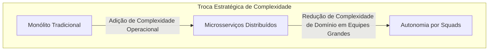
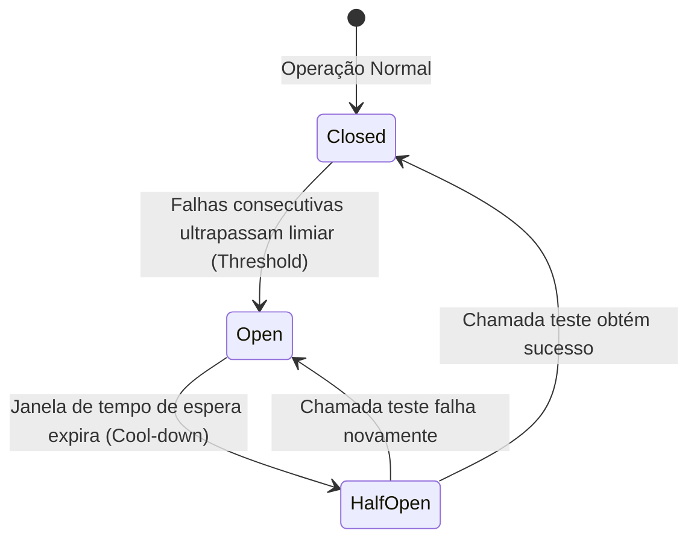
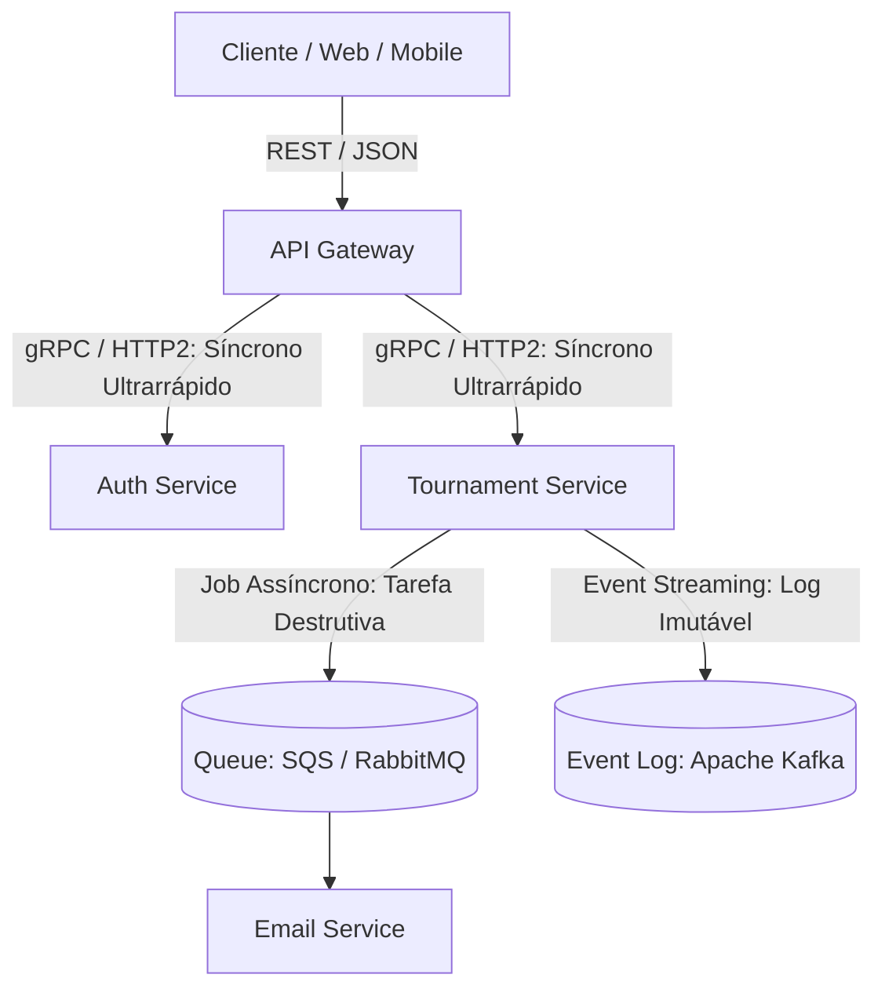
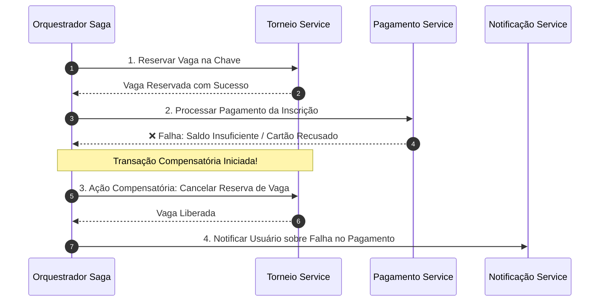
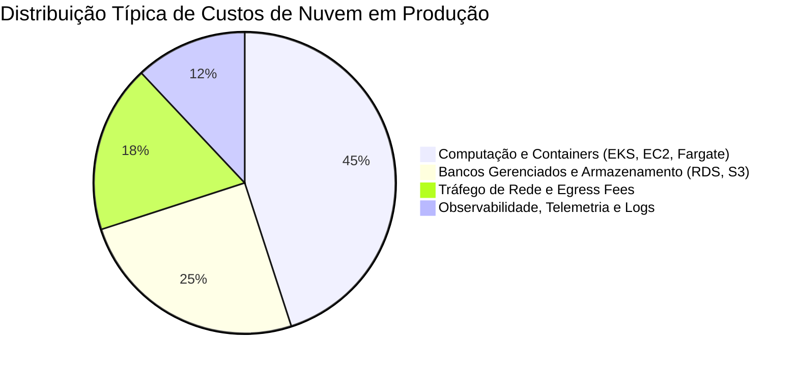
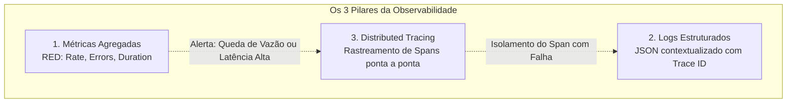

# ☁️ Aula 4: Arquitetura Moderna, Integração e Nuvem

> **Visão Geral:** Do mito dos microsserviços ao monólito modular e Lei de Conway. Padrões de resiliência em APIs distribuídas (Idempotência, Circuit Breakers, Exponential Backoff com Jitter), estratégias de mensageria (Filas vs. Streams vs. Sagas), composição de custos em Cloud (FinOps) e os três pilares da Observabilidade com OpenTelemetry.

---

## 1. Além do Hype: Monólito Modular vs. Microsserviços Reais

O debate arquitetural tradicional que classifica monólitos como "legado" e microsserviços como "o único caminho moderno" ignora os trade-offs reais de engenharia de software:

> **A Lei de Conway:**  
> *"As organizações que projetam sistemas são forçadas a produzir projetos que são cópias fiéis das estruturas de comunicação dessas mesmas organizações."*

Se uma empresa possui uma equipe de 6 desenvolvedores trabalhando juntos, dividir o sistema em 15 microsserviços gera um gargalo de comunicação devastador. A escolha entre monólito modular e microsserviços deve ser fundamentada na dinâmica organizacional e nos requisitos de escala independente:

### Comparativo Arquitetural de Produção

| Dimensão Técnica | Monólito Modular | Microsserviços Distribuídos |
| :--- | :--- | :--- |
| **Fronteiras de Domínio** | Módulos bem demarcados no mesmo executável | Serviços isolados com repositórios e deploys independentes |
| **Garantia Transacional** | Transações ACID nativas no banco de dados | Consistência eventual com necessidade de **Padrão Saga** |
| **Latência de Comunicação** | Zero latência de rede (chamadas em memória / thread local) | Latência de rede em cada chamada HTTP/gRPC entre serviços |
| **Complexidade Operacional** | Baixa; 1 pipeline de CI/CD, 1 artefato de deploy | Altíssima; múltiplos pipelines, telemetria distribuída, service mesh |
| **Depuração e Testabilidade** | Simples; execução ponta a ponta localmente | Exige mocks extensivos ou orquestração complexa de dependências |
| **Escalabilidade** | Escala da aplicação inteira como uma unidade | Escalabilidade granular apenas do serviço sob alta demanda |

---

## 2. APIs de Alta Confiabilidade e Resiliência em Sistemas Distribuídos

Em um ambiente distribuído, falhas de rede transitórias são uma certeza matemática, não uma exceção. Para garantir alta disponibilidade, a comunicação entre serviços deve adotar padrões rígidos:

### 2.1 Padrões Fundamentais de Resiliência
1. **Idempotência Estrita (Idempotency Key):**
   * Previne cobranças duplicadas ou inserções repetidas durante falhas de conexão.
   * O cliente envia um cabeçalho único (ex: `Idempotency-Key: req_abc123`). Se uma requisição de timeout cair e o cliente tentar novamente, o servidor identifica a chave, não reexecuta a ação de negócio e retorna o resultado pré-processado em cache.
2. **Paginação por Cursor (Cursor-based Pagination):**
   * Em bancos com milhões de registros, o uso de `OFFSET` obriga o banco a ler e descartar todos os registros anteriores (`OFFSET 50000 LIMIT 20` lê 50.020 linhas).
   * A paginação por cursor utiliza valores indexados e estáveis (`WHERE id > cursor_id ORDER BY id ASC LIMIT 20`), garantindo tempo de resposta constante $O(1)$ mesmo nas últimas páginas.
3. **Circuit Breakers (Disjuntores):**
   * Monitora a taxa de erro de chamadas a um serviço externo.
   * Se o serviço externo começar a falhar, o disjuntor **Abre (Open)**, cortando chamadas futuras imediatamente e retornando um fallback rápido, impedindo o efeito dominó de esgotamento de threads.
4. **Exponential Backoff com Jitter:**
   * Retentativas imediatas sobrecarregam ainda mais um serviço que acabou de falhar.
   * A retentativa deve aguardar um tempo exponencial com ruído aleatório (*jitter*):
   $$T_{\text{espera}} = 2^{\text{tentativa}} \times \text{intervalo\_base} + \text{random}(0, \Delta)$$

---

## 3. Padrões de Integração e Mensageria

A escolha do protocolo e modelo de comunicação determina o nível de acoplamento temporal e a performance da arquitetura:

### 3.1 Comparativo de Protocolos em Produção

| Protocolo / Padrão | Modelo de Comunicação | Melhor Cenário de Uso | Impacto Operacional |
| :--- | :--- | :--- | :--- |
| **REST / JSON** | Síncrono (Request / Response) | APIs públicas externas, integração com navegadores web e mobile | Baixo; universalmente suportado e documentado via OpenAPI |
| **gRPC / Protocol Buffers** | Síncrono / Streaming Binário (HTTP/2) | Comunicação interna de microsserviços de altíssima vazão | Médio; contratos rígidos tipados em arquivos `.proto` |
| **Filas (RabbitMQ / SQS)** | Assíncrono (Ponto a Ponto / Destrutivo) | Tarefas em background, envio de e-mails, processamento de vídeos | Baixo a Médio; suporte a Dead Letter Queues (DLQ) |
| **Event Streams (Kafka)** | Assíncrono (Append-only Event Log) | Auditoria imutável, pipelines analíticos e arquitetura orientada a eventos | Alto; gerenciamento de partições, offsets, replicação e retenção |

---

## 4. Transações Distribuídas: O Padrão Saga

Em sistemas distribuídos, manter a consistência de uma operação que atravessa múltiplos microsserviços sem utilizar bloqueios pesados (como o antipadrão Two-Phase Commit - 2PC) exige a implementação do **Padrão Saga**:

* **Transações Compensatórias:** Cada etapa com sucesso possui uma ação compensatória correspondente (`Criar Reserva` $\leftrightarrow$ `Cancelar Reserva`) que desfaz os efeitos de negócio caso uma etapa posterior falhe.
* **Saga Coreografada:** Os serviços escutam eventos no Kafka e decidem autonomamente o próximo passo. Adequada para fluxos curtos (2 a 3 serviços).
* **Saga Orquestrada:** Um componente central (Orquestrador) comanda explicitamente cada chamada e gerencia o estado da transação. Indispensável para fluxos complexos e auditáveis (como implementado no módulo `4-saga` do backend do Voleiplay).

---

## 5. FinOps e a Composição de Custos em Cloud

A disciplina de **FinOps** une engenharia, operações e finanças para garantir que a arquitetura em nuvem seja economicamente viável e sustentável:

### Armadilhas Ocultas de Custo:
1. **Taxas de Saída de Dados (Egress Fees):** Tráfego de rede entre diferentes zonas de disponibilidade (Availability Zones) ou regiões na AWS/GCP possui tarifação por gigabyte transferido. Microsserviços excessivamente "tagarelas" comunicando-se entre AZs disparam custos silenciosos.
2. **Ingestão Descontrolada de Logs:** Configurar logs no nível `DEBUG` em produção gera terabytes diários de dados em serviços como Datadog ou AWS CloudWatch, superando com frequência o valor pago pelos próprios servidores de aplicação.

---

## 6. Os Três Pilares da Observabilidade Moderna

Monitoramento passivo (verificar apenas se o servidor responde a ping) não é suficiente em arquiteturas distribuídas. A observabilidade moderna apoia-se em três pilares instrumentados de forma padronizada via **OpenTelemetry (OTel)**:

1. **Métricas Agregadas (Método RED):**
   * **Rate:** Quantidade de requisições por segundo recebidas.
   * **Errors:** Número de requisições que resultaram em erro (ex: HTTP 5xx).
   * **Duration:** Tempo de execução das requisições (analisado por percentis $p50$, $p95$ e $p99$, e nunca apenas por média aritmética).
2. **Logs Estruturados:**
   * Abandono do formato texto puro não padronizado em favor de JSON estruturado contendo campos obrigatórios: `timestamp`, `level`, `service_name`, `trace_id`, `span_id` e metadados contextuais do negócio.
3. **Distributed Tracing (Rastreamento Distribuído):**
   * Acompanha o caminho completo de uma única requisição através de dezenas de microsserviços por meio da propagação de cabeçalhos de contexto (W3C Trace Context).
   * Permite diagnosticar com precisão cirúrgica em qual nó ou query SQL ocorreu o gargalo de tempo.
