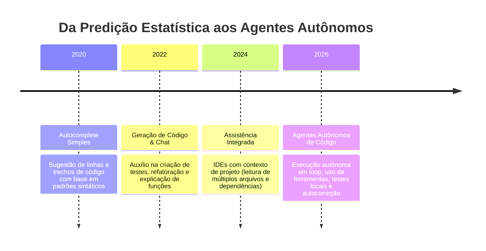
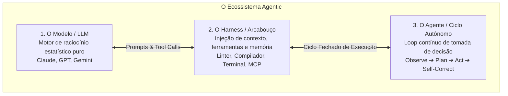
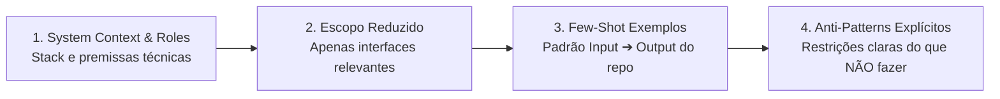
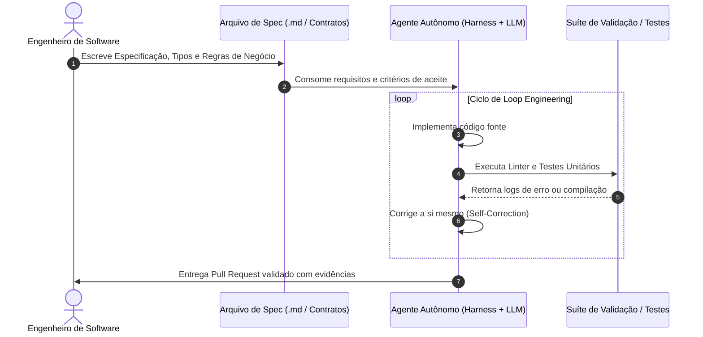

# 🤖 Aula 5: IA e Produtividade no Desenvolvimento

> **Visão Geral:** Da predição estatística de texto aos agentes autônomos de engenharia de software. A tríade Modelo-Harness-Agente, Engenharia de Prompts para desenvolvedores, Spec-Driven Development (SDD), Loop Engineering com autocorreção, Model Context Protocol (MCP) e as novas competências essenciais do engenheiro moderno.

---

## 1. A Evolução da Inteligência Artificial no Desenvolvimento de Software

A relação entre engenharia de software e Inteligência Artificial passou por uma transformação radical:



* **Do Autocomplete à Ação Operacional:** Os modelos de linguagem (LLMs) deixaram de ser apenas geradores estatísticos de texto para se tornarem sistemas com **capacidades operacionais reais**: executam chamadas de função (*tool/function calling*), interagem com terminais, compiladores e linters, e navegam de forma autônoma pela árvore de diretórios do repositório.
* **Os Níveis de Maturidade na Adoção de IA pelo Desenvolvedor:**
  $$\text{Autocomplete} \longrightarrow \text{Geração de Testes} \longrightarrow \text{Leitura de Código} \longrightarrow \text{Executor de Prompts} \longrightarrow \text{Engenharia de Prompts} \longrightarrow \text{Planejador de Tarefas} \longrightarrow \text{Agente Autônomo}$$

---

## 2. A Tríade Fundamental: Modelo, Harness e Agente

Para compreender a engenharia de software contemporânea orientada a IA, é imprescindível distinguir os três pilares que compõem um ecossistema agentic:



1. **O Modelo (LLM):**
   * O motor cognitivo de raciocínio (ex: Claude, GPT, Gemini).
   * Recebe um contexto delimitado e produz texto ou intenções de chamada de ferramentas. **O modelo isolado não tem acesso direto a arquivos, redes ou bancos de dados sem auxílio externo.**
2. **O Harness (A Estrutura / *Harness Engineering*):**
   * O ecossistema de software que envolve o modelo.
   * Responsável por injetar o contexto relevante do repositório, fornecer acesso seguro a ferramentas (linters, compilador TypeScript, terminal bash, logs de erro) e controlar a memória da sessão.
3. **O Agente (O Ciclo Autônomo):**
   * A fusão coordenada entre o Modelo e o Harness operando em um **loop autônomo**:
   $$\text{Observar o Ambiente} \longrightarrow \text{Planejar a Ação} \longrightarrow \text{Executar Ferramenta} \longrightarrow \text{Avaliar Erro/Retorno} \longrightarrow \text{Autocorreção}$$

---

## 3. Engenharia de Prompts Estruturada para Engenheiros

Diferente do uso informal de chatbots, a engenharia de prompts para desenvolvimento de software de alta qualidade exige rigor e métodos determinísticos:



* **System Context & Roles:** Estabelecer a stack exata, as versões de bibliotecas e os padrões de design antes de solicitar código (ex: *"Você é um arquiteto trabalhando no Voleiplay com Angular 21, Signals e arquitetura de componentes standalone"*).
* **Escopo Reduzido e Focado:** Não sobrecarregar a janela de contexto (*Context Window*) com arquivos desnecessários. Injetar apenas as interfaces, tipos e assinaturas fundamentais para evitar alucinações.
* **Few-Shot Prompting Tecnológico:** Fornecer exemplos reais do padrão utilizado na base de código antes de pedir a implementação de um novo módulo.
* **Anti-Patterns e Restrições Explícitas:** Declarar expressamente as regras negativas (ex: *"Não utilize `any` no TypeScript"*, *"Não altere a assinatura da interface pública"*, *"Não instale novas dependências no `package.json` sem autorização"*).

---

## 4. Spec-Driven Development (SDD): Desenvolvimento Guiado por Especificações

No paradigma de **Spec-Driven Development (SDD)**, a responsabilidade do engenheiro de software migra da digitação manual de sintaxe para a **autoria de especificações técnicas rigorosas**:



* O engenheiro não digita código linha por linha nem conduz interações baseadas em adivinhação: ele constrói artefatos estruturados contendo requisitos funcionais, contratos de dados (OpenAPI, TypeScript interfaces) e critérios de aceite (Gherkin/BDD).
* O agente autônomo executa a implementação e valida o resultado contra a própria especificação antes de submeter ao revisor humano.

---

## 5. Loop Engineering e Autovalidação

O desenvolvimento assistido por agentes não opera em requisições únicas e isoladas (*One-shot Prompting*), mas em um **ciclo contínuo de autovalidação**:

1. O desenvolvedor define o objetivo e os limites arquiteturais.
2. O agente altera o código e cria os arquivos no repositório.
3. O Harness executa automaticamente o compilador, o linter estático e os testes unitários.
4. Caso ocorra erro de compilação ou falha de assert, **o log de erro é realimentado diretamente na próxima iteração do modelo**, permitindo que ele corrija a si mesmo (*Self-Correction*) sem intervenção humana.

---

## 6. As Novas Habilidades do Engenheiro de Software

Com a automação da digitação de código sintático, o valor do profissional de tecnologia se concentra em três competências de alto nível:

| Nova Competência | Descrição Prática | Onde a IA Precisa da Supervisão Humana |
| :--- | :--- | :--- |
| **1. Visão Arquitetural Holística** | Domínio sobre modelagem de domínio, desacoplamento de serviços, escolha de tecnologias de persistência e padrões de integração. | A IA tende a resolver problemas isolados sem considerar a sustentabilidade a longo prazo de todo o ecossistema. |
| **2. Auditoria Crítica e Code Review** | Atuação como parecerista sênior: inspeção de segurança (injeção de código, segredos expostos), consumo de memória, concorrência e débito técnico. | Códigos gerados por IA podem compilar com perfeição e passar em testes superficiais, mas conter falhas graves de performance ou brechas de segurança. |
| **3. Estratégia de Testes e Edge Cases** | Criação de cenários de teste complexos, testes de carga, simulações de failover e cobertura de casos de borda imprevisíveis. | Garantir que as premissas de negócio do produto sejam testadas sob estresse severo. |

---

## 7. Model Context Protocol (MCP) e Ferramental de Agentes

O **Model Context Protocol (MCP)** é um protocolo aberto que padroniza a forma como modelos de IA se comunicam com ferramentas, bancos de dados e ambientes externos:

```mermaid
graph TD
    AGENT_CORE[Agente de IA / LLM]
    
    subgraph Protocolo MCP (Fronteiras e Boundaries)
        MCP_DB[MCP Banco de Dados: Consultas SQL controladas]
        MCP_CHROME[MCP Chrome DevTools: Acessibilidade e Profiling]
        MCP_EXT[MCP APIs Externas / Provedores Biometria e Pagamento]
    end

    AGENT_CORE <-->|Chamadas Padronizadas JSON-RPC| MCP_DB
    AGENT_CORE <-->|Inspeção de DOM e Performance| MCP_CHROME
    AGENT_CORE <-->|Requisições com Mascaramento| MCP_EXT
```

### Casos de Uso Corporativos de Skills e MCP:
1. **Automação de Fluxos Repetitivos (Skills):**
   * Criação de comandos padronizados (ex: `/ship`) que executam o linter, rodam a suíte de testes, analisam o `git diff` e geram a mensagem de commit no padrão Conventional Commits de forma determinística.
2. **Acesso Seguro a Dados com Limites Rígidos (Boundaries):**
   * Utilização de agentes para consulta de dados de parceiros externos mantendo mascaramento de dados sensíveis (PII) e isolamento em sandbox.

---

## 8. Governança, Segurança e Propriedade Intelectual

Aspectos críticos para a adoção corporativa de ferramentas de inteligência artificial:

* **Anonimização de Dados e Proteção de Privacidade:** Agentes e provedores de LLM devem operar sobre dados anonimizados, impedindo o vazamento de segredos corporativos, chaves de API e informações confidenciais de usuários finais.
* **Propriedade Intelectual do Código Gerado:** Os termos de serviço dos principais provedores corporativos de IA (Anthropic, Google, Microsoft) estabelecem explicitamente que **o código fonte produzido pertence integralmente ao usuário e à sua respectiva organização**, garantindo segurança jurídica para a comercialização de produtos digitais.
